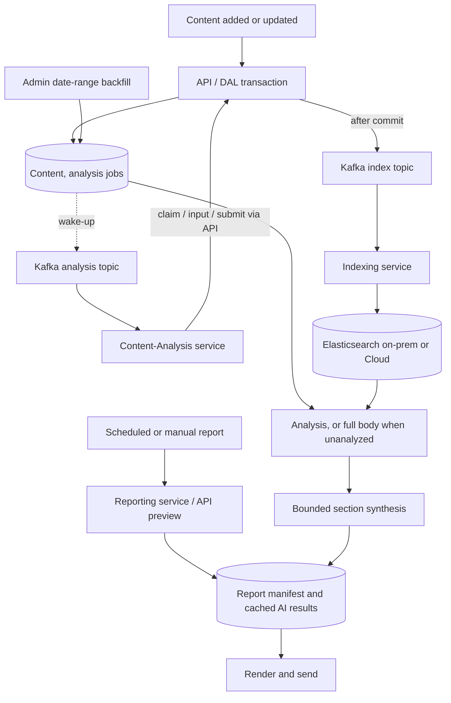

# Content Analysis and Scalable Report AI

Status: **Implemented** on the `content-analysis` branch (2026-09-30), not yet released. See
[IMPLEMENTATION.md](IMPLEMENTATION.md) for what was built, deviations, deployment order, and open
questions.

## Goals

- Analyze content automatically as it is added or updated, with a Kafka-woken Content-Analysis
  service that replaces Quote Extraction.
- Persist structured analysis in PostgreSQL and index it in Elasticsearch.
- Populate empty editorial fields while preserving human changes.
- Make report AI sections process every included story through bounded, token-budgeted synthesis,
  and generate each result once.
- Keep reporting independent: reports run on schedule, never wait for analysis, and never request
  it.
- Let administrators backfill analysis for a chosen date range.

## Phases

Each phase ships on its own and delivers value without the later ones.

| Phase | Document | Delivers |
| --- | --- | --- |
| 1 | [01-report-synthesis.md](01-report-synthesis.md) | Bounded, cached report AI over existing story text |
| 2 | [02-content-analysis.md](02-content-analysis.md) | Content-Analysis service, editorial population, analysis search fields; retires Quote Extraction and NLP |
| 3 | [03-indexing-reliability.md](03-indexing-reliability.md) | Transactional index requests, ordered Elasticsearch writes, mutation-path coverage |
| 4 | [04-backfill.md](04-backfill.md) | Administrative date-range analysis backfill |

Independent workstreams:

| Document | Delivers |
| --- | --- |
| [05-topic-scoring.md](05-topic-scoring.md) | Topic score rule fixes, rescoring, and a rebuilt `/admin/topic-scores` page. Must ship before Phase 2 enables topic population. |
| [06-history-retention.md](06-history-retention.md) | Configured purging of report (90 days) and notification (30 days) history |

Phase 1 fixes today's unbounded report prompts immediately. Phase 2 improves report input quality
by replacing full bodies with analysis for analyzed stories. Phase 3 hardens delivery under both.
Phase 4 extends analysis coverage to historical content.

## Confirmed decisions

| Topic | Decision |
| --- | --- |
| Relationship to automation | New event-driven service. Reuses `TNO.AI` `LlmDirectClient` and the `llm` table. The automation engine is unchanged; values it writes are machine-owned (`automation`) and Content-Analysis never overwrites them. |
| LLM provider | Azure AI deployments configured in the `llm` table, as reports and automation use today. |
| Eligibility | All content is analyzed; administrators configure excluded media types and sources. |
| Triggering | A quiet period per content ID (default 2 minutes) after the last input change; only the latest input is analyzed. |
| Work queue | A database job table is the source of truth (priority, lease, fencing token). Kafka messages only wake workers. |
| Populated fields | Summary, Tags, Contributor, Quotes, and Topics — only when empty and not cleared by a human, and only for the processes the Content-Analysis service is configured to run. |
| Topics | Staff-managed `Topic` list. Assigned when the service runs its `Topics` process, with a mode: use existing active topics only, or allow creating topics. Scores come from the topic score rules, refactored in [05-topic-scoring.md](05-topic-scoring.md). Unmatched extracted topics go to an analysis topic registry. |
| Analysis retention | Analysis records last as long as their content. |
| History retention | Report history purged after 90 days and notification history after 30, per [06-history-retention.md](06-history-retention.md). |
| Existing values at migration | Every populated value is human-owned. |
| Concurrent editing | Accepting analysis increments `Version` and pushes a hub `ContentUpdated` (reason `analysis`) so an open editor form merges the change. |
| Report readiness | Reports never wait. Analyzed stories contribute analysis; unanalyzed stories contribute their full body, chunked. Missing analysis simply means less refined input. |
| Report input before analysis exists | Full body, split into budget-sized chunks. No truncation. |
| Report topic headings | The matched staff Topic when present, otherwise the registry label. |
| Agent-backed AI sections | Unchanged. Bounded synthesis applies to direct-model LLMs only. |
| Re-index side effects | Analysis re-indexing keeps the indexer's notification and folder forwarding. Duplicate alerts are left to `NotificationValidator` resend rules (see [accepted risks](#accepted-risks)). |
| Elasticsearch ordering | `version_type=external_gte` with the projection revision; hard deletes kept, with a raised `index.gc_deletes`. No tombstones. |
| Elasticsearch clusters | Both supported: on-prem (local, DEV) and Elastic Cloud (TEST, PROD), each 7.17.x. The on-prem PROD backup cluster is being retired. |
| Tunable values | Every numeric threshold is configuration with the proposed default (see [configuration](#configuration)). |
| NLP service | Retired; Content-Analysis supersedes it. |
| Existing bugs | Fixed within the phases (see [bug fixes](#bug-fixes)). |

## Current implementation

Verified against the code; these are the constraints each phase starts from.

| Area | Current behavior |
| --- | --- |
| Quote Extraction | Consumes the `index` topic but only acts on `Publish` (`ExtractQuotesOnPublish=true`, `OnIndex=false`). LLM configured in appsettings (Gemini primary, Mistral fallback), not the `llm` table. Rate limiter registered but never called. No transcript-approval check (TODO at `services/net/extract-quotes/ExtractQuotesManager.cs:300`). |
| Quote persistence | `POST services/contents/{id}/quotes` sends only a SignalR hub message, **no index request**, so new quotes are not searchable until the next re-index. `Quote` has no provenance or offsets. |
| Content concurrency | `AuditColumns.Version` is an EF concurrency token incremented in `SaveChanges`. Conflicts return HTTP 400. The topics endpoint does not increment it; `UpdateStatusOnly` does (including the indexer's publish); series merge (`ExecuteUpdate`) bypasses it. |
| Kafka publishing | Always after the database commit — no outbox. A crash or Kafka failure after commit loses the index request. Failed messages are skipped, not retried. |
| Indexing | Reads latest content from the API, writes full documents to `unpublished_content` and (published) `content` with no versioning. Every index sends a `notify` message and forwards to `folder`. A second `IndexOnly` indexer writes Elastic Cloud, where names are `content` (all) and `published_content`. |
| Elasticsearch | 7.17.9. NEST 7.17.5 (API, DAL, reporting), Elastic.Clients.Elasticsearch 8.0.10 (indexing), 8.16.0 (migration tool). Mappings rely on dynamic mapping for `source`, `mediaType`, `owner`, `series`, `quotes`. No composite aggregations, PIT, or `search_after` in use. Queries are raw JSON passed through. |
| Reporting service | One report at a time (`MaxThreads: 1`, one replica), processed inside the Kafka handler; offset committed on success or failure. |
| Report AI | Direct path sends every story's **full body** plus previous instances in one request, with no token limit. Agent path sends only prompts. AI runs again on every API preview/view and at send; output persists only inside `report_instance.body`. |
| LLM settings | `llm` table has deployment, agent, endpoint, key, temperatures, prompts — no context window, output limit, or rate limit. |
| Automation | Scheduled/manual LLM runs that already set summary, tags, contributor, sentiment, and actions via `LlmDirectClient`. |
| Topics | Staff-managed `Topic` (Issues/Proactive). `ContentTopic.Score` is calculated by `TopicScoreHelper` from topic score rules; Event of the Day charts aggregate on it. |
| Editorial ownership | No field-level ownership or auto-populated markers exist. |

## Architecture

- Analysis jobs are written in the same transaction as the content change. Index requests are
  sent to Kafka once it commits, before the API responds; if Kafka does not accept them the
  request fails.
- Reporting reads whatever analysis exists. It never creates jobs, waits, or requests backfills.

## Configuration

All values are configuration; the defaults are proposals to confirm before rollout.

| Setting | Default | Phase |
| --- | --- | --- |
| Token safety margin | 10% of context window | 1 |
| Maximum synthesis reduction depth | 8 | 1 |
| Analysis quiet period | 2 minutes | 2 |
| Transient retry attempts before a job fails | 5 | 2 |
| Excluded media types / sources | none | 2 |
| Content-Analysis processes | Metadata, Summary, Quotes, Tags, Contributor, Topics (service configuration) | 2 |
| Topic population mode | existing active topics only | 2 |
| API Kafka producer message timeout | 10 seconds | 3 |
| `index.gc_deletes` | to confirm (longer than the longest redelivery delay) | 3 |
| Indexing write attempts | 3 | 3 |
| Backfill share of provider throughput | 20% | 4 |
| Source default topic score | none (0) | Topic scoring |
| `ReportRetentionDays` | 90 | Retention |
| `NotificationRetentionDays` | 30 | Retention |

## Bug fixes

| Bug | Fix | Phase |
| --- | --- | --- |
| `ChoiceIndex == -1` builds all choices but never assigns them, so the AI section renders empty (`libs/net/template/ReportEngine.cs:1062-1071`). | Assign the joined choices. | 1 |
| Quotes attached through the services API are not re-indexed. | Send an index request after attaching quotes. | 2 |
| Subscriber content delete never removes the Elasticsearch document. | Send `IndexAction.Delete` after the delete commits. | 3 |
| `tools/indexer` blanks `Body` after building the model, so unapproved AV transcripts reach the published index (`tools/indexer/IndexerManager.cs:158-159`). | Blank before building, and share the rule with the indexing service. | 3 |
| Service appsettings use `MaxFailLimit`, but the option is `MaxFailureLimit`, so the setting is never bound. | Rename the appsettings key in every service. | 3 |

## Accepted risks

- **Duplicate alerts on analysis re-index.** The indexer sends a `notify` message on every index.
  Notifications with the `Updated` or `Republished` resend option can therefore fire again when
  analysis finishes after publication. Phase 2 measures this once analysis runs; if it
  occurs, revisit by honouring an index `Reason` in the indexer.
- **Report duration.** Bounded synthesis of large reports takes longer than one request, and the
  reporting service handles one report at a time. Phase 1 measures generation time and sets
  `MaxThreads`/replicas accordingly.
- **Agent-backed AI sections** keep today's behavior: no story content is sent and the agent's
  Azure-side tools are not restricted, so coverage and provenance are not guaranteed for them.

## Rollback

Each phase is behind its own feature switch. Disabling Phase 2 pauses the Content-Analysis workers
and population but keeps jobs and results; Quote Extraction is not re-enabled alongside it, so two
quote writers never run together. Disabling Phase 1 is not a return to unbounded prompts: bounded
synthesis stays the only direct-model path once released.
