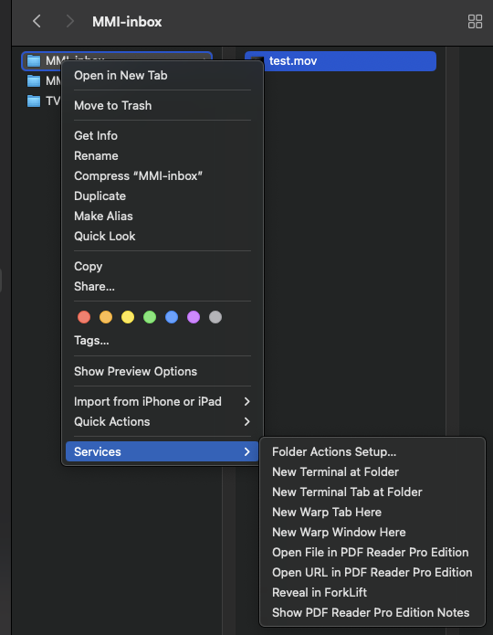
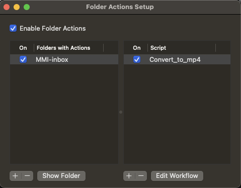

# Install and Setup Mac OS .mov File Converter

This solution requires installing FFmpeg on each Mac, and configuring two Automator workflows to convert the .mov files.

## Install with Package

Copy the package and double click it on your Mac `./tools/mov-converter/MovConverter.pkg`

This will install Rosetta, FFmpeg and the Automator scripts. You will need to "Enable Folder Actions" on the `~/Movies/MMI-inbox` folder.

### Enable Folder Actions

Go to the `~/Movies/MMI-inbox` folder and right+click. Then go to the menu `Services -> Folder Actions Setup...`. Click the `Folder Actions Setup...`.



On the left side select and enable the `MMI-inbox` if it isn't already.
On the right side add and/or enable the `Convert_to_mp4` script.



> If the above package does not work it will require you to manually do the following steps.

## Install FFmpeg

The simple solution is to download and add the `ffmpeg` binary to the path.

1. Download [here](https://ffmpeg.org/download.html#build-mac)
2. Extract the ZIP
3. Run the following commands

```bash
  sudo cp ./ffmpeg /usr/local/bin
  sudo chmod ugo+x /usr/local/bin/ffmpeg

  # If using zsh
  open -e ~/.zshrc

  # add and save
  export PATH="/usr/local/bin:$PATH"

  # If using bash
  open -e ~/.bash_profile

  # add and save
  export PATH="/usr/local/bin:$PATH"
```

4. Fiddle with the Mac OS to allow execution of `ffmpeg`. Using Finder, open the file `/usr/local/ffmpeg` and allow it to run.
5. Create folder `~/Movies/MMI-inbox`
6. Create folder `~/Movies/MMI-outbox`
7. Create Automator script

Choose "Folder Action"
Select the `~/Movies/MMI-inbox` folder
You should also add a "Filter Finder Items" and limit it to "Any" file kinds that are "music" or "movie".
Add a "Run Shell Script", and set the "Pass input" to "as arguments", and enter the following.

```zsh
for f in "$@"
do
  path=$(dirname "$f")
  filename=${f##*/}
  name=${filename%.*}
  echo "$f"

  cd $path
  /usr/local/bin/ffmpeg -y -hide_banner -loglevel error -i $f -c copy ../MMI-outbox/${name}.mp4
done
```

Save the Automator as "Auto Convert to mp4"

8. Create Automator script

Choose "Quick Actions"
Select "Automatic (files or folders)" in "any application"
You should also add a "Filter Finder Items" and limit it to "Any" file kinds that are "music" or "movie".
Add a "Run Shell Script", and set the "Pass input" to "as arguments", and enter the following.

```zsh
for f in "$@"
do
  path=$(dirname "$f")
  filename=${f##*/}
  name=${filename%.*}
  echo "$f"

  cd $path
  /usr/local/bin/ffmpeg -y -hide_banner -loglevel error -i $f -c copy ${name}.mp4
done
```

Save the Automator as "Convert to mp4"
