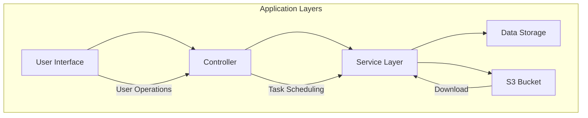

# S3 File Downloader

S3 File Downloader is a Python-based desktop application for downloading files from S3-compatible storage buckets. It provides a GUI and scheduled download functionality.

## Features

- Connect to S3-compatible storage services
- Scheduled automatic file downloads
- Local storage space monitoring
- Download history viewing

## System Architecture

### Architecture Overview



### Component Layers

1.  **User Interface Layer (UI)**
    -   Desktop GUI built with PySide6
    -   Includes: File management panel, download control, system settings
    -   Responsibility: User interaction display and operation response

2.  **Controller Layer**
    -   Download Controller: Manages download queue and task scheduling
    -   Settings Controller: Handles configuration changes
    -   Scheduler: Manages scheduled tasks

3.  **Service Layer**
    -   S3 Client: Implements file transfer using boto3
    -   Storage Monitoring: Checks disk space
    -   Error Handling: Detects network stability and handles errors

4.  **Data Layer**
    -   SQLite Database: Stores download history
    -   Local File System: Stores downloaded files

### Data Flow

1.  User triggers a download request through the UI
2.  Controller creates a download task and adds it to the queue
3.  Service layer retrieves file metadata from S3
4.  File stream is transferred from S3 to local storage
5.  Download record is written to the SQLite database
6.  UI loads history from the database for display

## Technology Stack

-   **GUI Framework**: PySide6 (6.5.0+)
-   **S3 Client**: boto3 (1.28.0+)
-   **Database**: SQLite (via peewee ORM 3.16.0+)
-   **Database Migration**: peewee-migrate (1.13.0+)
-   **Build Tool**: PyInstaller (6.13.0+)
-   **Code Formatter**: ruff (0.11.8+)
-   **Type Checker**: pyright (1.1.400+)
-   **Environment Variables**: python-dotenv (1.0.0+)
-   **Package Manager**: uv

-   Python 3.11

## Installation Dependencies

### uv Installation

```bash
# Install uv (if not already installed)
curl -sSfL https://astral.sh/uv/install.sh | sh

# Create and activate virtual environment
make activate

# Install dependencies
make install
```

### Manual Installation

```bash
# Create virtual environment
uv venv .venv

# Activate virtual environment (Windows bash)
source ./.venv/Scripts/activate

# Sync dependencies
uv sync
```

## Configuration Settings

Copy the `.env.example` file to `.env` and modify the configuration:

```ini
# S3 Configuration
S3_SERVICE_URL=bucket_url        # S3 Service URL
S3_BUCKET_NAME=local             # Bucket Name
S3_ACCESS_KEY=your_access_key    # Access Key
S3_SECRET_KEY=your_secret_key    # Secret Key
S3_TIMEOUT=2                     # Timeout in seconds

# Local Storage Configuration
LOCAL_STORAGE_PATH=./downloads   # File Download Path

# Database Configuration
DATABASE_URL=sqlite:///./s3_downloader.db  # SQLite Database Path

# Scheduled Task Configuration
SCHEDULER_INTERVAL=3600          # Download Interval in seconds, default 1 hour

# Error Handling Configuration
MAX_CONSECUTIVE_FAILURES=3       # Maximum Consecutive Failures
MAX_FAILURE_PERCENTAGE=0.3       # Maximum Failure Percentage (0.0-1.0)
NETWORK_TEST_INTERVAL=5          # Network Test Interval

# Disk Space Configuration
SPACE_WARNING_THRESHOLD=0.1      # Disk Space Warning Threshold (0.0-1.0)
```

## Running the Program

```bash
python main.py
```

## Building Executable

### Prerequisites

1.  Ensure the `.env` file is configured
2.  Ensure the virtual environment is activated
3.  Ensure all dependencies are installed

### Build Steps

```bash
# Activate virtual environment
make activate

# Run the build script
python build.py
```

### Build Notes

-   The build script uses PyInstaller and the `s3_downloader.spec` configuration file
-   Previous build files will be automatically cleaned up
-   The build process will embed the `.env` file into the executable
-   After a successful build, you can find `S3Downloader.exe` in the `dist/` directory

## Project Structure

```
s3-downloader/
├── .env.example             # Environment variable example
├── .gitignore              # Git ignore file
├── build.py                # Build script
├── main.py                 # Program entry point
├── Makefile               # Automation build script
├── pyproject.toml         # Project configuration and dependencies
├── s3_downloader.spec     # PyInstaller configuration file
├── uv.lock               # Dependency lock file
├── dist/                 # Build output directory
├── documents/            # Project documentation directory
├── images/              # Image resources directory
└── src/                 # Source code directory
    ├── __init__.py
    ├── client/          # S3 client module
    │   ├── __init__.py
    │   └── s3_client.py # S3 operation core implementation
    ├── database/        # Database module
    │   ├── __init__.py
    │   └── models.py    # Database model definition
    ├── settings/        # Configuration management module
    │   ├── __init__.py
    │   ├── default_settings.py  # Default configuration
    │   └── settings_loader.py   # Configuration loader
    └── UI/              # User interface module
        ├── __init__.py
        ├── app.py       # Application entry point
        ├── main_window.py       # Main window
        ├── s3_controller.py     # S3 controller
        ├── components/          # UI components
        │   ├── buttons_panel.py
        │   ├── history_widget.py
        │   ├── log_widget.py
        │   ├── schedule_info_widget.py
        │   └── storage_info_widget.py
        ├── controllers/         # Controller logic
        └── widgets/            # Custom widgets
```